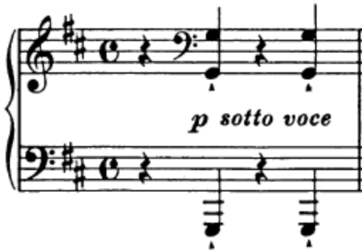

##

## *Sotto Voce:* Federated Machine Learning for Speech Recognition with Two-sided Privacy 

##  Overview

Our goal is to build an end-to-end speech recognition system using a federation of audio corpus training sets, through differentially private learning, to provide a robust, privacy-preserving scalable implementation, free from membership and reconstruction attacks, and also offering confidential model construction to the user analyst.

##  Introduction

Sotto Voce is a system for creating speech recognition models that solve the four fundamental privacy barriers to building an effective system for collaborative speech modeling.    This framework allows speech data owners to combine their respective training resources for increased model accuracy 1] *without the need to share raw data* and 2] *without revealing the set of models each partner needs to train*, and guarantee to produce models that 3] *will not leak who is in the data*, or 4] *anything they have been recorded saying*.  

## Differential Privacy

Differential Privacy, deriving from roots in cryptography, is a formal, mathematical definition of privacy preservation. A differentially private algorithm typically injects a precisely calculated quantity of noise to the answer to any statistical query, sufficient to mask the possible contribution of any one individual to the result.   Informally, it guarantees that any released query, statistical result, or model does not reveal information about any one single individual. Differential privacy provides the ability to formally reason about the privacy-loss of any output from the data, to provide guarantees against membership and reconstruction attacks.  Reassuringly, the privacy guarantee is future-proof against a worst-case adversary, who may have unlimited computational power, employ attacks that are not yet known to the literature, and have unlimited auxiliary information to exploit about other values in the dataset.

## Speech Recognition

The modern speech recognizer is a data-hungry beast. The tremendous increase in accuracies these systems have achieved in the last ten years is matched only by their demand for ever larger datasets. While industrial systems feast on 1000's of hours of training data, recognition systems built for the smaller niche use cases are forced to survive on tiny morsels. This disparity occurs when systems are expected to work in scenarios and languages for which data is scarce. While small pockets of such data are owned by various organizations, barriers commonly exist that prevent sharing.  This lack of sharing capability can manifest itself in real-world financial costs to locate or create alternative data sources.  Federated learning with differential privacy provides a framework for building models collaboratively, without revealing or leaking the raw sensitive data outside of the control of the individual data owners.
